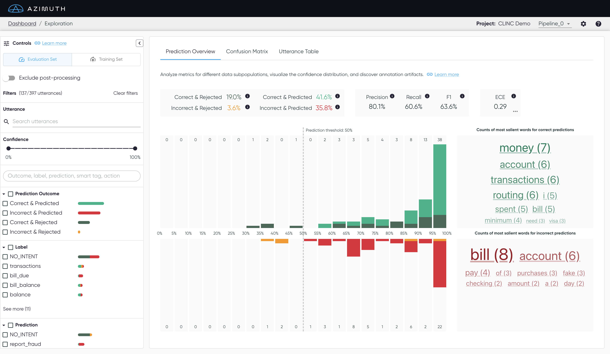
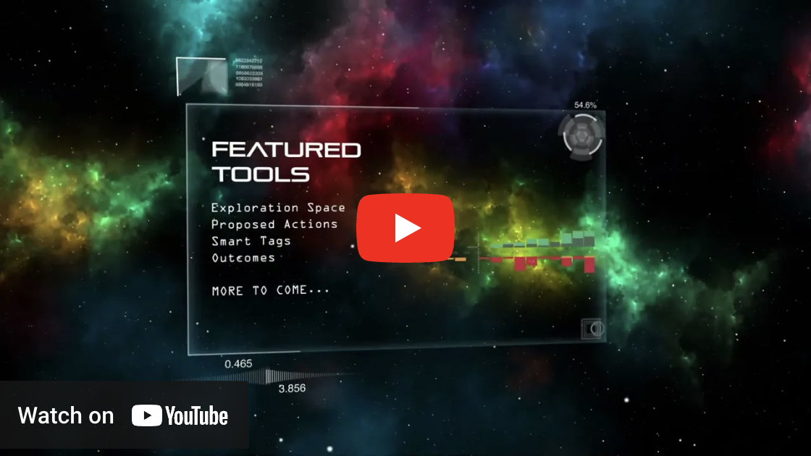

<p align="center">
  <br>
  
  <br>
  <br>
  <a href="https://github.com/ServiceNow/azimuth/actions/workflows/pythonci.yml">
    </a>
  <a href="https://servicenow.github.io/azimuth">
    </a>
  <a href="https://join.slack.com/t/azimuth-org/shared_invite/zt-1i9eu48n9-7NnCXHw5VzUs~gs20xHxyg">
    </a>
  <a href="./LICENSE">
    </a>
  <a href="https://doi.org/10.5281/zenodo.6511558">
    </a>
  <a href="https://arxiv.org/abs/2212.08216">
    </a>
  <a href="https://azimuth-demo.net/">
    </a>

  <br>
  <br>
  Azimuth, an open-source dataset and error analysis tool for text classification, with love from ServiceNow.
</p>

<p align="center">
  
</p>

## Overview

Azimuth is an open source application that helps AI practitioners and data scientists better
**understand their dataset and model predictions** by performing thorough **dataset** and **error
analyses**. The application leverages different tools, including robustness tests, semantic
similarity analysis and saliency maps, unified by concepts such as **smart tags** and **proposed
actions**. It currently only supports **text classification use cases**.

### Published Paper at [EMNLP](https://2022.emnlp.org/)

Our paper was accepted as a [system demo at EMNLP 2022](https://www.servicenow.com/research/publication/gabrielle-gauthier-melancon-azim-emnlp2022.html). It is available [here](https://arxiv.org/abs/2212.08216).

### Documentation

Our [documentation](https://servicenow.github.io/azimuth) contains all the instructions and
references to use Azimuth.

* [Getting Started](https://servicenow.github.io/azimuth/getting-started)
  contains all the instructions to **install** and **launch** the app.
* [Key Concepts](https://servicenow.github.io/azimuth/key-concepts) explains the different
  **concepts and analyses** that are provided in Azimuth to perform dataset and error analysis.
* [User Guide](https://servicenow.github.io/azimuth/user-guide) goes **screen per screen** to
  explain the different **interactions and visualizations** available.
* [Reference](https://servicenow.github.io/azimuth/reference) details the config file and the
  different **contracts** which allow **configuring** Azimuth with different datasets and pipelines.
* [Development](https://servicenow.github.io/azimuth/development) guides on how to develop and
  **contribute** to the repo.

### YouTube Playlist

<p align="center">
  <a href="https://www.youtube.com/playlist?list=PLdq4WQvLzJCnJmInRYBSfeCWLiHbX55V8">
    
  </a>
</p>

## Run Our Demo

After installing the requirements, as explained
in [Installation](https://servicenow.github.io/azimuth/getting-started/a-install/), run the
following command to run the demo. More details
in [Learn Basics](https://servicenow.github.io/azimuth/getting-started/b-basics/).

```
pip install gdown
make download_demo
make CFG_PATH=/config/development/clinc/conf.json launch
```

Once the startup tasks are completed, you will be able to access Azimuth at `http://localhost:8080`.
To learn more about Azimuth's features, refer to
our [Key Concepts](https://servicenow.github.io/azimuth/key-concepts) and
our [User Guide](https://servicenow.github.io/azimuth/user-guide).

To use your own dataset and models, please refer to
[Run on Your Use Case](https://servicenow.github.io/azimuth/getting-started/c-run/).

## How to Contribute?

Refer to our [`CONTRIBUTING.md`](CONTRIBUTING.md).

### Code Documentation

At different places in the code, you'll find `README` files explaining further how the back end works. Don't hesitate to
add other `README` files in appropriate places, and don't forget to edit them if you change these components.

* In [azimuth](azimuth/README.md), explaining the main back-end components.
* In [azimuth/modules](azimuth/modules/README.md), explaining how modules work.
* In [azimuth/routers](azimuth/routers/README.md), explaining how to add new routes.

### Repo Structure

```bash
├── azimuth  # Back End
│   ├── modules
│   │   └── Where core capabilities are implemented
│   ├── plots
│   │   └── Plotting functions
│   ├── routers
│   │   └── FastAPI routers
│   ├── types
│   │   └── Specific pydantic types that this application is based on
│   ├── utils
│   │   └── Extra utilities
├── azimuth_shr
│   └── Custom code that is shareable.
├── config
│   └── Config files for different data/models
├── docs
│   └── User documentation
├── tests
│   └── Unit/integration tests
├── webapp
│   └── Front End
├── docker-compose.yml # Where the config and images are specified.
├── docker-compose-gpu.yml # Extension to use Azimuth with gpus.
└── runner.py # Application entrypoint.
```

## Contact

To contact us, join our [slack](https://join.slack.com/t/azimuth-org/shared_invite/zt-1i9eu48n9-7NnCXHw5VzUs~gs20xHxyg) or send us an [email](azimuth-team@servicenow.com)!

## License

The package is licensed by ServiceNow, Inc. under the Apache 2.0 license. See [LICENSE](LICENSE) for more details.

## Vulnerability Reporting
Please notify psirt-oss@servicenow.com regarding any vulnerability reports in addition to following current reporting procedure.
