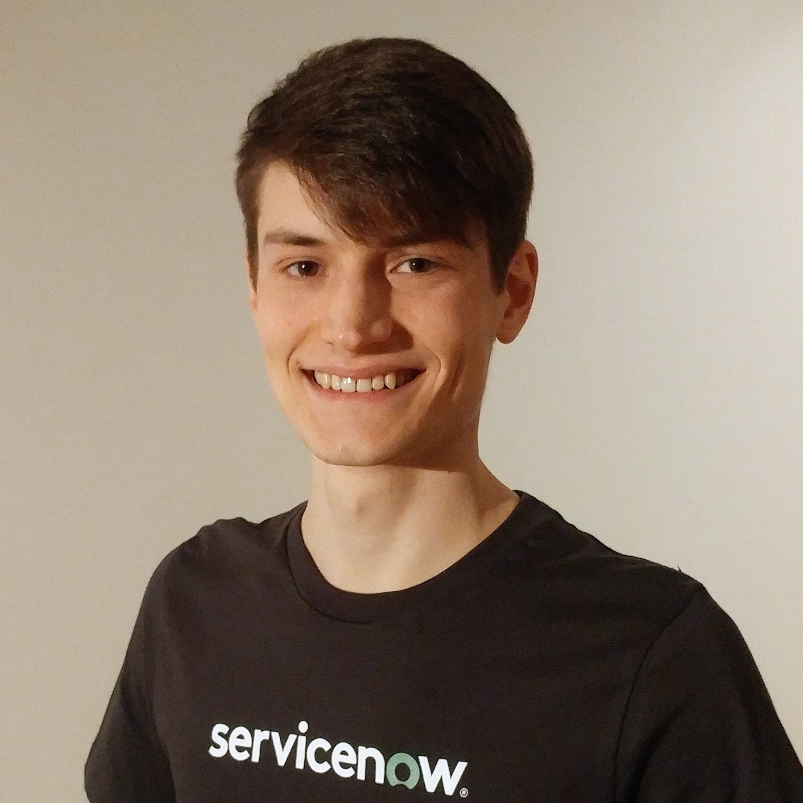
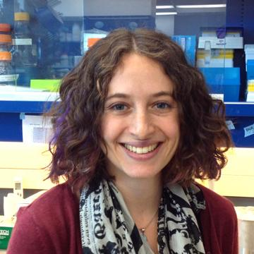
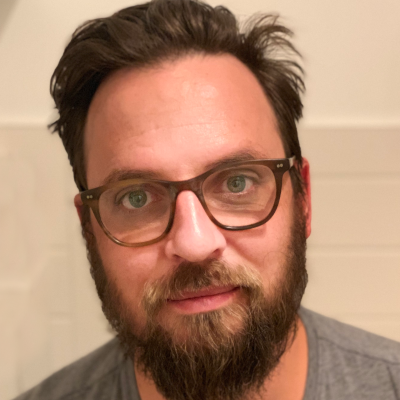
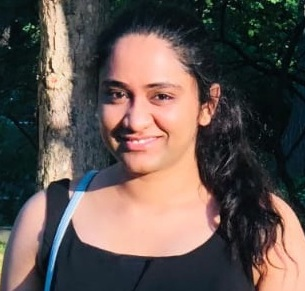
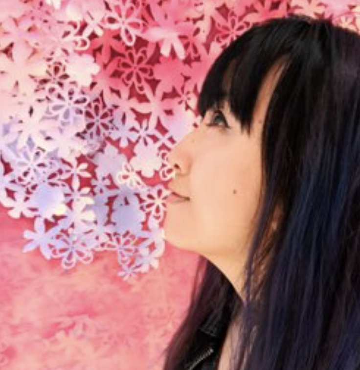

# About Us

We started developing Azimuth :material-telescope: at the beginning of 2021, as an internal tool at
ServiceNow. We are open source since April 2022. Our motivation in developing this tool is to go
beyond the traditional model quality assessment based solely on high-level metrics. We strongly
believe that much more can be discovered and understood from our dataset and models if we have the
right tools, visualizations, and interfaces. We hope this can be helpful to you, and that you enjoy
Azimuth! :smiley:

## The Team

### Main Contributors

{ width=200 align=left }

#### Frédéric Branchaud-Charron [:material-github:](https://github.com/Dref360) [:material-linkedin:](https://www.linkedin.com/in/frédéric-branchaud-charron-5387b8ba/)

Fred works as an Applied Research Scientist specializing in Bayesian deep learning, active
learning and uncertainty estimation. In addition to maintaining Azimuth, he also maintains BaaL,
a Bayesian active learning library.

{ width=200 align=left }

#### Gabrielle Gauthier-Melançon [:material-github:](https://github.com/gabegma) [:material-linkedin:](https://www.linkedin.com/in/gabriellegma/)

Gab is an Applied Research Scientist, interested in explainability, uncertainty and topics related
to building trust in AI. Since the beginning of Azimuth, she is leading the product ideation, while
being involved in designing the user interface, documenting it, and maintaining the back end.

{ width=200 align=left }

#### Joseph Marinier [:material-github:](https://github.com/JosephMarinier) [:material-linkedin:](https://www.linkedin.com/in/josephmarinier/)

Joseph is a full-stack developer who enjoys designing and engineering solutions to a large variety
of problems. His main contribution to Azimuth has been leading the frontend development.

{ width=200 align=left }

#### Lindsay Brin [:material-github:](https://github.com/lindsaydbrin) [:material-linkedin:](https://www.linkedin.com/in/lindsaydbrin/)

Lindsay is an Applied Research Scientist working in explainability and NLU, who loves the concept of
representing language in mathematical space. Her journey through data analysis, modeling, and
visualization started with research in biogeochemistry and ecosystem ecology.

{ width=200 align=left }

#### Chris Tyler [:material-github:](https://github.com/christyler3030) [:material-linkedin:](https://www.linkedin.com/in/chris-tyler-b9597239/)

Chris is a software developer with a background in physics and an interest in everything. He has
contributed to the design and development of the Azimuth user interface.

{ width=200 align=left }

#### Nandhini Babu [:material-github:](https://github.com/nandhinibsn) [:material-linkedin:](https://www.linkedin.com/in/nandhini-babu-209a83132/)

Nandhini is a developer at ServiceNow who joined Azimuth in January 2022. She's mostly contributing
on the front end. Her overall experience is around web development.

### Designers

We can also count on the support of amazing designers.

{ width=200 align=left }

#### Di Le [:material-linkedin:](https://www.linkedin.com/in/dile/)

Di Le is an AI/ML design strategist, and a contributor to the intelligent automation of enterprise
software at ServiceNow. Her work focus surrounds human-centered AI design and creating systems that
augment, automate and accelerate how people work.

{ width=200 align=left }

#### Karine Grande [:material-linkedin:](https://www.linkedin.com/in/karine-grande-b9583514/)

Karine is a Product Designer working on experiences that use AI/ML technology. In addition of
helping on the design side of Azimuth, she worked on projects about data labelling, classification,
summarization and forecasting, and is currently working on document processing and data extraction.

{ width=200 align=left }

#### Nikola Simic [:material-linkedin:](https://www.linkedin.com/in/nikolasimic/)

Nikola is a Senior Product Designer working on products that leverage responsible and ethical AI and
Machine Learning across the enterprise space. He created the Azimuth visual identity and is
developing Azimuth's branding and video materials.

### Other Contributors

{ width=200 align=left }

#### Orlando Marquez [:material-github:](https://github.com/marquezo) [:material-linkedin:](https://www.linkedin.com/in/orlando-e-marquez-85b141134/)

Orlando is a Lead Applied Research Scientist with a strong background in software engineering. One
of his passions is shipping state-of-the-art NLP to end-users through rigorous and careful
experimentation. His early contributions to Azimuth revolved around saliency maps for NLP and
similarity-based analysis.

{ width=200 align=left }

#### Michael Lanoie [:material-linkedin:](https://www.linkedin.com/in/michaeldeanlanoie/)

Michael is a technical writer working on product documentation for AI/ML software at ServiceNow. He
contributed as a content editor and collaborator, helping improve the UX and the documentation.

{ width=200 align=left }

#### Sean Hughes [:material-linkedin:](https://www.linkedin.com/in/seanhughes/)

Sean leads cross-functional AI ecosystem strategy and engagement at ServiceNow, bringing his
experience in AI developer community development to help the team launch and drive adoption of
Azimuth.

## Special Thanks

Thank you Sethu Meiyappan, and Francis Ruel for helping us on the path to open sourcing!
