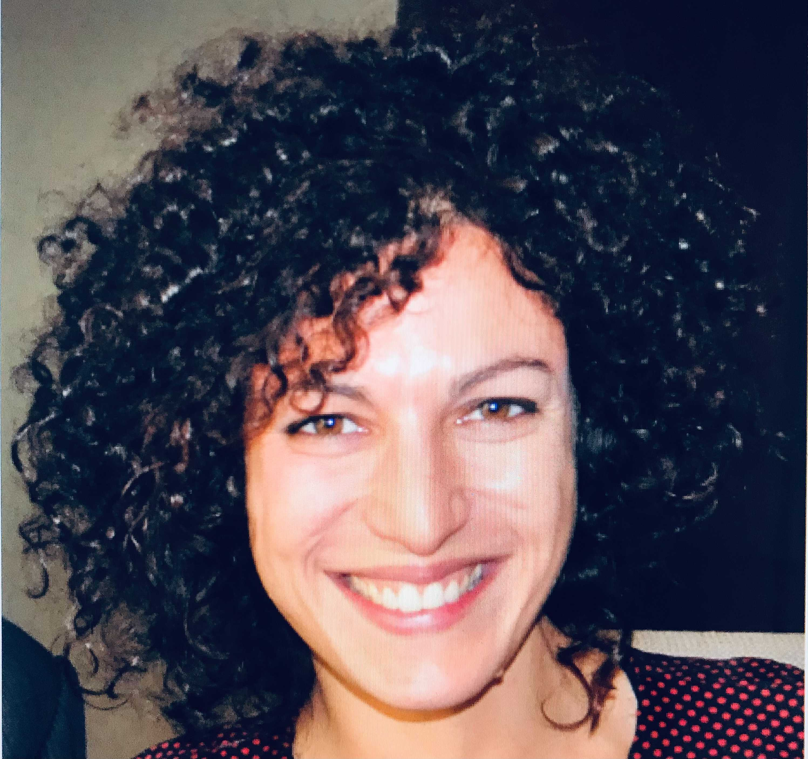

# About Us

We started developing Azimuth :material-telescope: at the beginning of 2021, as an internal tool at
ServiceNow. We are open-source since April 2022. Our motivation in developing this tool is to go
beyond the traditional model quality assessment based solely on high level metrics. We strongly
believe that much more can be discovered and understood from our dataset and models if we have the
right tools, visualizations and interfaces. We hope this can be helpful to you, and that you enjoy
Azimuth! :smiley:

## The Team

### Main Contributors

{ width=200 align=left }

#### Frédéric Branchaud-Charron [:material-github: Dref360](https://github.com/Dref360)

Fred works as an Applied Research Scientist specializing in Bayesian deep learning, active
learning and uncertainty estimation. In addition to maintaining Azimuth, he also maintains BaaL,
a Bayesian active learning library.

{ width=200 align=left }

#### Gabrielle Gauthier-Melançon [:material-github: gabegma](https://github.com/gabegma)

Gab is an Applied Research Scientist, interested in explainability, uncertainty and topics
related to building trust in AI. She's involved in maintaining the back end, designing the user
interface and documenting Azimuth. She's been dreaming about building a tool like Azimuth for a
few years now.

{ width=200 align=left }

#### Joseph Marinier [:material-github: JosephMarinier](https://github.com/JosephMarinier)

Joseph
is a full-stack developer who enjoys designing and engineering solutions to a large variety of
problems. His main contribution to Azimuth has been in the front end.

{ width=200 align=left }

#### Lindsay Brin [:material-github: lindsaydbrin](https://github.com/lindsaydbrin)

Lindsay
is an Applied Research Scientist working in explainability and NLU, who loves the concept of
representing language in mathematical space. Her journey through data analysis, modeling, and
visualization started with research in biogeochemistry and ecosystem ecology.

{ width=200 align=left }

#### Chris Tyler [:material-github: christyler3030](https://github.com/christyler3030)

Chris is a
software developer with a background in physics and an interest in everything. He has
contributed to the design and development of the Azimuth user interface.

{ width=200 align=left }

#### Nandhini Babu [:material-github: nandhinibsn](https://github.com/nandhinibsn)

Nandhini
is a developer at ServiceNow who joined the ATG team in January 2022. She's mostly contributing
on the front end. Her overall experience is around web development.

### Designers

We can also count on the support from amazing designers.

{ width=200 align=left }

#### Karine Grande

Karine is a Product Designer working on experiences that use AI/ML technology. In addition of
helping on the design side of Azimuth, she worked on projects about data labelling,
classification, summarization and forecasting, and is currently working on document processing
and data extraction.

## Special Thanks

Thank you to all others who helped us developing this!

* Orlando Marquez [:material-github: marquezo](https://github.com/marquezo) for his initial
  contributions and continuous feedback.
* Nikola Simic for creating the visual identity of Azimuth.
* Michael Lanoie for feedback on our documentation.
* Sean Hugues for helping us on the path to open sourcing.
