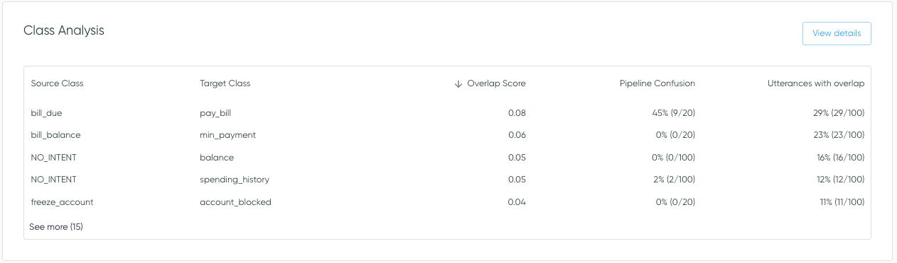

# Class Similarity

## What is it?

Class analysis includes an aspect of similarity analysis, which is based on the relative locations of utterances in embedding space. Because of this, it only requires training data to be supplied.

Class analysis extends other
[:material-link: Similarity Analysis](./similarity.md) features to
focus on class-level conclusions and downstream actions. In particular, **class overlap**
assesses the similarity between pairs of classes, and whether samples in a source class overlap
with a target class. In some cases, this overlap may be associated with poor class definitions,
mislabelling, and/or model confusion.

## Where is this used in Azimuth?

In Azimuth, Class Similarity is shown in the Class Analysis table on the Dashboard. It is also
used for the Class Overlap plot.

<figure markdown>

<figcaption>
Class Analysis table on the Dashboard.
</figcaption>
</figure>

<figure markdown>

<figcaption>
Class Overlap plot on the Class Analysis page, accessed via the Dashboard.
</figcaption>
</figure>

## How is it Computed?

### Class Overlap

Class overlap is calculated using utterance embeddings, which are computed as described in
[:material-link: Similarity Analysis](./similarity.md).

Class overlap for class *Ci* (source class) with class *Cj* (target class) is
defined as the area of the feature (embedding) space in which an utterance in class
*Ci* has a greater probability of being in class *Cj* than in class
*Ci*.

To approximate this probability, we make use of the
[`spectral-metric`](https://github.com/Dref360/spectral-metric) package
([Branchaud-Charron, 2019](https://arxiv.org/abs/1905.07299)[^1]). The probability of a sample
being in a specified class is determined based on the representation of this class in the
sample's 20 nearest neighbors, as well as the hypervolume containing these neighbors (Parzen
window). Class overlap for the *Ci* with the *Cj* is calculated as the mean
probability across all samples in *Ci*. The similarity matrix *S* from `spectral-metric`
contains these probabilities for all class pairs. Note that probabilities are normalized by the
source class, to sum to 1.

### Samples with overlap

Individual samples from a source class are determined to have overlap with a target class when
their probability of being in the target class is greater than 0, which is the same as saying
that at least one of their 20 nearest neighbors are from the target class. This is a
conservative metric, on which we anticipate iterating in the future.

## Configuration

See
[:material-link: Similarity Analysis Configuration](
../reference/configuration/analyses/similarity.md)
for details how to change the encoder for the embeddings on which class overlap is computed.
Note that this encoder model is also used for analyses described in
[:material-link: Similarity Analysis](./similarity.md)

[^1]: Branchaud-Charron, Frederic, Andrew Achkar, and Pierre-Marc Jodoin. "Spectral metric for
dataset complexity assessment." Proceedings of the IEEE/CVF Conference on Computer Vision and
Pattern Recognition. 2019.