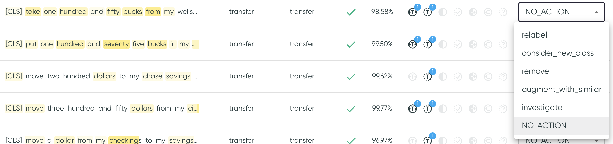

# Proposed Actions

In the utterance table or the utterance details, annotations can be added to indicate whether an
action should be taken for each data sample. The annotations can be exported with
the dataset from
the [:material-link: Utterances Table](../user-guide/exploration-space/utterances-table.md).

<figure markdown>
  
  <figcaption>Proposed Actions in the Utterances Table of the Exploration Space</figcaption>
</figure>

Five proposed actions are currently supported:

* **Relabel**: The label for this utterance should be changed.
* **Augment with Similar**: This utterance lacks nearby utterances in the same class, and new,
  similarly labeled utterances should be added.
* **Add New Class**: This data point may belong to a new class that doesn't exist in the
  currently defined classes. Based on the number of data points identified with this action, a user
  may choose to add a new class.
* **Merge Classes**: The label and the predicted class for this data point may be too similar. Based on the number of data points identified with this action, a user may choose to merge the two classes.
* **Remove**: This data point is irrelevant or otherwise problematic, and should be removed from the
  dataset.
* **Investigate**: The action is not yet clear, but the data point should be further
  investigated/discussed, within Azimuth or outside the tool.
