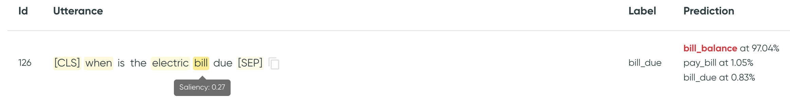

# Saliency Map

## What is it?

Saliency map is a **feature-based explainability** (XAI) method, available for gradient-based ML
models. Its role is to estimate how much each **variable contributes to the model prediction** for a
given data sample. In the case of NLP, variables are usually tokens or words.

### Literature

In NLP, the current state-of-the-art models (Transformers) are **black boxes**. It’s not
trivial to understand why they make mistakes or why they are right.

Saliency maps first became popular for computer vision problems, where the results would be a
'heatmap' of the most contributing pixels. There has been recent growing interest in saliency maps
as an XAI technique for NLP:

* [Wallace et al.](https://arxiv.org/abs/1909.09251)[^1] in their AllenNLP toolkit implement vanilla
  gradient, integrated gradients, and smoothGrad for several NLP tasks and mostly pre-BERT models.
* [Han et al.](https://arxiv.org/abs/2005.06676)[^2] use gradient-based saliency maps for sentiment
  analysis and NLI on BERT.
* [Atanasova et al.](https://arxiv.org/abs/2009.13295)[^3] evaluate different saliency techniques on
  a variety of models including BERT-based.
* [Bastings and Filippova](https://arxiv.org/abs/2010.05607)[^4] argue to use saliency maps over
  attention-based explanations when determining the input tokens most relevant to a prediction.
  Their end-user is a model developer, not a user of the system.

!!! note

    Apart from saliency map, other feature-based XAI techniques exist, such as SHAP or LIME.

## Where is this used in Azimuth?

In Azimuth, we display the saliency map on a specific utterance to show the importance of each token
in the model prediction. When available, it is both displayed in
the [Utterance Details](../user-guide/exploration-space/utterance-details.md) and in
the [Utterances Table](../user-guide/exploration-space/utterance-details.md).

<figure markdown>
  
  <figcaption>Saliency map of a specific utterance.</figcaption>
</figure>

!!! example

    In this example, "assistance" is the most contributing word for predicting `transfer`,
    followed by "moving".

## How is it computed?

We use the technique `Vanilla Gradient`, shown to satisfy **input invariance**
in [Kindermans et al.](https://arxiv.org/abs/1711.00867)[^5]. We simply **back-propagate the
gradient**
to the input layer of the network, in our case, the word-embedding layer. We then take the `L2` norm
to aggregate the gradients across all dimensions of the layer to get to the saliency value for each
token.

!!! note

    Saliency map is only available for models that have gradients. Additionally, their input layer
    needs to be a token-embedding layer, so that the gradients can be computed per token. For
    example, a sentence embedder cannot back-propagate the gradients with sufficient granularity in
    the utterance.

### Configuration

Assuming the model architecture allows for saliency maps, the name of the input layer needs to be
defined in the config file, as detailed in
[Model Contract Configuration](../reference/configuration/model_contract.md).

[^1]:Wallace, Eric, et al. "Allennlp interpret: A framework for explaining predictions of nlp
models." arXiv preprint arXiv:1909.09251 (2019).
[^2]:Han, Xiaochuang, Byron C. Wallace, and Yulia Tsvetkov. "Explaining black box predictions and
unveiling data artifacts through influence functions." arXiv preprint arXiv:2005.06676 (2020).
[^3]:Atanasova, Pepa, et al. "A diagnostic study of explainability techniques for text
classification." arXiv preprint arXiv:2009.13295 (2020).
[^4]:Bastings, Jasmijn, and Katja Filippova. "The elephant in the interpretability room: Why use
attention as explanation when we have saliency methods?." arXiv preprint arXiv:2010.05607 (2020).
[^5]: Kindermans, Pieter-Jan, et al. "The (un) reliability of saliency methods." Explainable AI:
Interpreting, Explaining and Visualizing Deep Learning. Springer, Cham, 2019. 267-280.

--8<-- "includes/abbreviations.md"
