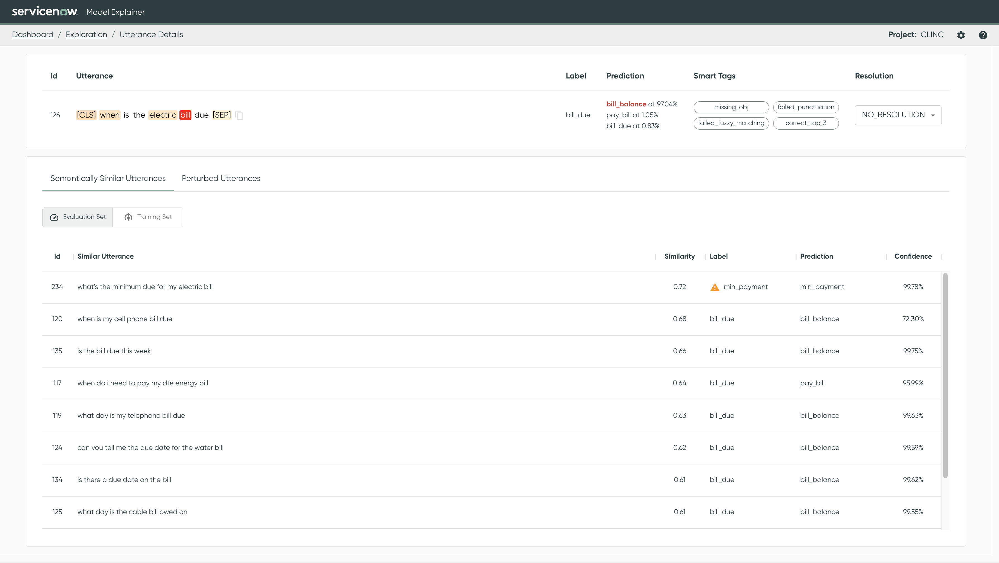

# Similarity Analysis

## What is it?

Similarity analysis is based on the relative locations of utterances in embedding space. This
analysis can be quite powerful given that **no trained ML model is needed**; only a dataset needs to
be provided.

Within Azimuth, different similarity analyses are conducted to determine how similar utterances are
within a class, across classes, and so on.

## Where is this used in Azimuth?

In Azimuth, the similarity analysis is used to derive [:material-link: Smart Tags](smart-tags.md),
and also to show the most similar utterances in both dataset splits on
the [:material-link: Utterances Details](../user-guide/exploration-space/utterance-details.md).

<figure markdown>
  
  <figcaption>Similar utterances in the Utterance Details.</figcaption>
</figure>

## How is it Computed?

### Similarity Computation

To get utterance embeddings, Azimuth uses a **sentence encoder** (`all-MiniLM-L12-v2`
from [sentence-transformers](https://github.com/UKPLab/sentence-transformers)) based on a **BERT**
architecture ([Reimers and Gurevych, 2019](https://arxiv.org/abs/1908.10084)[^1]). It then computes
the **cosine similarity** (via a **dot product on normalized embeddings**) between each utterance in
the dataset and all other utterances in both dataset splits (training and evaluation).

On the [:material-link: Utterances Details](../user-guide/exploration-space/utterance-details.md),
the most similar examples are presented in descending order (i.e., most similar first), along with
the cosine similarity to the selected utterance. A cosine similarity of 1 indicates that the
utterance is identical, while 0 indicates that it is unrelated.

### Smart Tags

#### No Close Tags

Some utterances may have **no close neighbors** in a dataset split - that is, their most similar
utterances have low cosine similarities. When the cosine similarity of an utterance's **closest
neighbor is below a threshold** (default = 0.5), the utterance gets tagged with
`no_close_train` and/or `no_close_eval`, according to the dataset split being assessed (training or
evaluation). Note that this tag is class label-agnostic.

#### Few Similar Tags

It can be useful to assess whether the most similar data samples to an utterance (its neighbors)
come from the same or different classes. When most of its **neighboring utterances are from a
different class**, it might indicate a mislabeling issue, overlapping classes, data drift, or simply
a difficult utterance to predict.

Two [:material-link: Smart Tags](./smart-tags.md) highlight these sorts of utterances, based on the **label
heterogeneity of the neighborhood** in each dataset split (training or evaluation). If 90% or more
of an utterance's most similar data samples (neighbors) in a dataset split belong to a different
class, it will be tagged as `few_similar_train` and/or `few_similar_eval`, based on which dataset
split is being examined. (E.g., an utterance in the test set will be compared to its neighbors in
both the training and evaluation dataset splits.)

### Configuration

[:material-link: Similarity Analysis Configuration](../reference/configuration/similarity.md)
details how to change the encoder for the embeddings on which similarity is computed, as well as the
two thresholds used to determine the smart tags.

[^1]: Reimers, Nils, and Iryna Gurevych. "Sentence-bert: Sentence embeddings using siamese
bert-networks." arXiv preprint arXiv:1908.10084 (2019).

--8<-- "includes/abbreviations.md"
