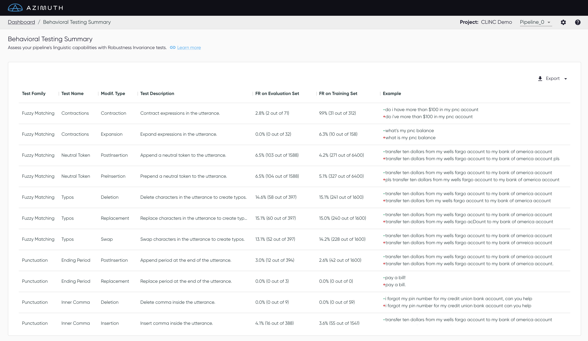

# Behavioral Testing Summary

The Behavioral Testing Summary displays a report with the **failure rates of each test**, on both
the evaluation set and the training set.  _Invariant_ (the modification should not change the
predicted class) tests are currently supported.

[:material-link: Behavioral Testing](../key-concepts/behavioral-testing.md) in Key Concepts gives
detailed information on the tests.

## Table Content

- Each test belongs to a **family** and a **name**. The test categorization is then further broken
  down by **modification type**. The verb of the description is used to name the modification type.
- The **failure rate (FR)** indicates the number of total failed utterances, over all modified
  utterances generated for each test. Hover over the `FR` to see the average delta (absolute
  difference) in the prediction confidence, i.e. when the predicted class remains the same as the
  original utterance.
    - The failure rate on the **training set** is the performance of the modified training set when
      tested with the trained model. This might be useful to test the robustness of the model on
      data points it has already seen, before taking the extra step of understanding robustness in
      the presence of new data.
- The last column shows one **example** from the dataset of the modifications that were made on the
  original utterance.

!!! tip "Sort the table"

    :material-sort: Click the failure rate headers to sort the values in ascending or descending
    order.

## Download

A summary of the test results can be **downloaded**, as well as the **modified sets** generated for
both the evaluation set and training set. Download the required file by clicking **Export**
:material-download: in the upper right corner of the table and then selecting the appropriate item
from the menu.
