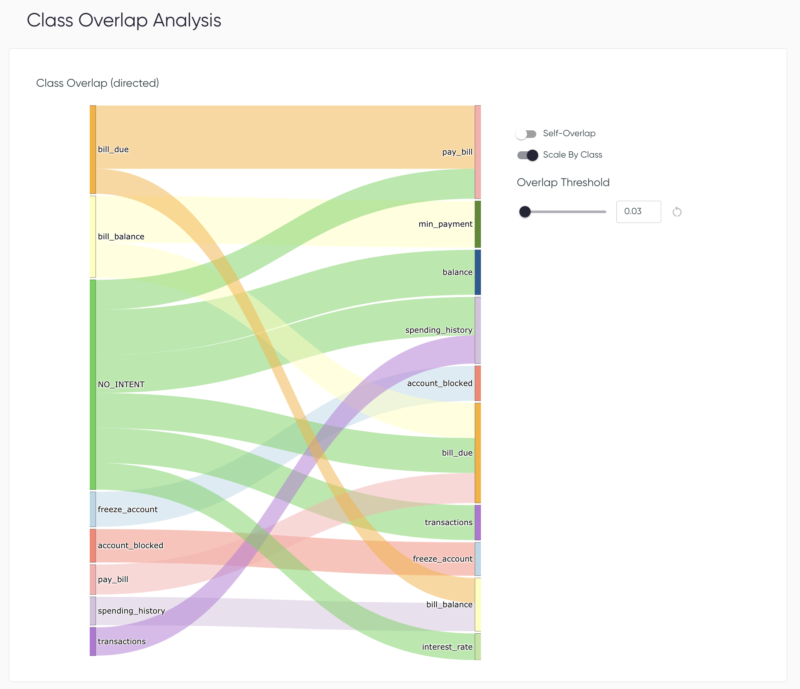

# Class Overlap

Class overlap assesses the semantic overlap between pairs of classes. In some cases, high
overlap may be associated with poor class definitions, mislabelling, and/or model confusion.

Class overlap is determined with a dataset alone, based on the locations of utterances in
embedding space, as described in
[:material-link: Similarity Analysis](../key-concepts/similarity.md).

## Class Overlap Plot

The Class Overlap plot shows the extent to which source classes semantically overlap target 
classes, all in the training data. The source class is the class label, and the target class is 
the class that the source class may look like, based on its nearest neighbors. As such, flows 
between class nodes indicate whether samples in a source class are in neighborhoods typified 
by other classes (class overlap) or its own class (self overlap). For each source class, class 
overlap and self-overlap values sum to 1, unless values are scaled by class size.

Overlap is displayed as flows from source class (nodes on the left) to target classes (right).
Nodes are ordered with flows for greatest overlap values towards the top, so as to highlight these
class pairs. Wider flows indicate greater overlap values. Colors group flows from the same
source class. The plot is interactive, in that nodes can be moved and reordered via dragging.

### Plot options

* **Minimum displayed overlap value**: This value determines which overlap flows will be displayed
  on the plot. Vary this value to focus on class pairs with greatest overlap, or to see all
  overlap to better understand the complexity of the dataset. The default value is set to the
  tenth-highest class overlap value for ease of visualization alone, and will differ across
  different datasets.
* **Self-Overlap**: This toggle determines whether to show flows for overlap of a class with
  itself, to get a sense of the relative magnitude (and possibly importance) of class overlap.
* **Scale by Class Size**: Overlap values are normalized by source class, such that the sum of
  all class overlap and self-overlap values for a source class is 1. This toggle multiples overlap
  values by class sample sizes, changing node size and flow width accordingly.

### Suggested workflow

The plot options described above allow for exploration of different aspects of class overlap. To
navigate them, we suggest the following workflow:

#### 1. Default view: Self-Overlap off, Scale By Class Size on

- Start here. This view shows you the class pairs with the greatest (scaled) semantic overlap
  scores in the dataset. Vary the minimum displayed overlap value to see all dataset overlap or
  to focus on the class pairs with the greatest overlap scores.
- Because Scale By Class Size is on, this view will emphasize overlapping classes with greater
  sample counts. This is useful if you are less concerned about class overlap from
  source classes with few samples in the training data. However, if you want to further investigate
  classes with high overlap values but fewer samples, either for better understanding your dataset 
  or because some classes might have high business value, then you can toggle `Scale By Class Size`
  to off, as explained in step 2.

#### 2. Toggle Scale By Class Size:

- When Scale By Class Size is turned off, total flows (class overlap and self-overlap) sum to 1.
  This view emphasizes class pairs with the greatest class overlap scores, regardless of
  whether the source class has many samples in it.
- This is useful to further understand class overlap for classes that have relatively fewer
  samples in them, which might not have been as visible during the analysis at step 1.

#### 3. Toggle Self-Overlap :

- For any given class, turning on Self-Overlap lets you compare the extent to which its samples
  semantically overlap other classes (class overlap) vs. samples of its own class (self-overlap).
  For example, if self-overlap is much higher than class overlap, class overlap may be less
  problematic for this class, and vice versa.

!!! tip

    :material-restart: Click the reset button next to the overlap threshold value to reset to
    the default threshold.

<figure markdown>

<figcaption>
Class Overlap plot on the Class Overlap page, accessed via the Dashboard.
</figcaption>
</figure>

