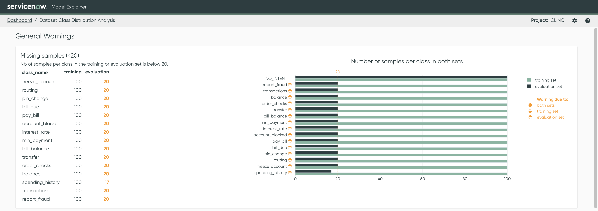
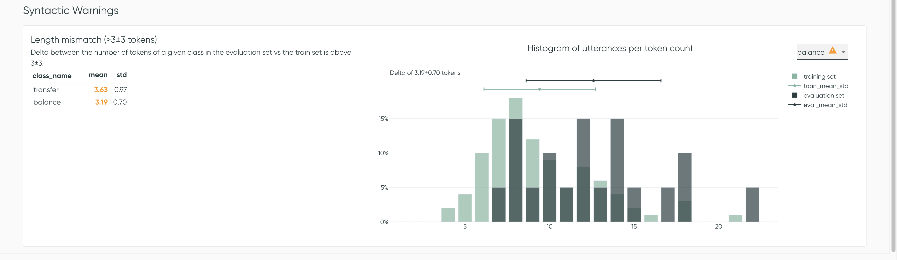

# Dataset Class Distribution Analysis

A **discrepancy** between the training and evaluation sets can cause problems with a model. For
example, the model may **not have a representative sample** of examples to train on, making it **
hard to generalize**
in production.

Alternatively, you might be measuring the performance of the model on an evaluation set that may **
not be a good indicator of the performance in production**. Distribution analysis aims to give
warnings when the training and evaluation sets look too different in some aspect of the data.

## General Warnings

Azimuth performs 2 analyses to assess class size in the training vs evaluation sets.

### Missing samples

In this first analysis, the application flags when a class has **fewer than `X`** (default is 20)
samples in either the training or the evaluation set. The plot helps to visualize the values for
each class.

### Class Imbalance

In this second analysis, Azimuth detects class imbalance issues. It raises a flag for all classes
where the relative difference between the number of samples and the mean in a dataset split is above
a certain threshold `Y`. The default is 50%.

### Representation mismatch

The third analysis flags if a class is **over-represented** in the evaluation set (relative to
other classes) or the training set. If the delta between the percentage of a class in each set is
above `Z`% (default is 5%), the analysis flags it.

## Syntactic Warnings

Syntactic warnings indicate differences in the syntax of the utterances between each set.

### Length mismatch

Length mismatch compares the number of **tokens per utterance** in both sets. The application flags
a warning if the mean and/or standard deviation between the 2 distributions is above `A` and `B` (
default is 3 for both) respectively.

## Configuration

All thresholds mentioned (`X`/`Y`/`Z`/`A`/`B`) can be modified in the config file, as explained
in [:material-link: Dataset Warnings Configuration](../reference/configuration/analyses/dataset_warnings.md).
