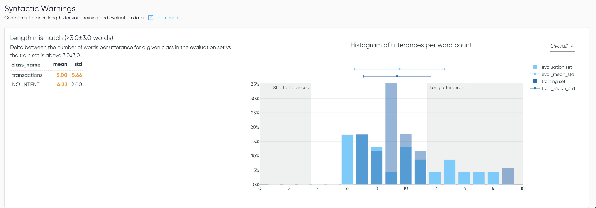

# Dataset Warnings

Datasets can suffer from a variety of issues, such as class imbalance, classes with low sample counts, and dataset shift. These warnings help detect some of these issues.

## Missing samples

In this first analysis, the application flags when a class has **fewer than `X`** (default is 20)
samples in either the training or the evaluation set. The plot helps to visualize the values for
each class.

## Class Imbalance

In this second analysis, Azimuth detects class imbalance issues. It raises a flag for all classes
where the relative difference between the number of samples in that class and the mean sample count per class in a dataset split is above
a certain threshold `Y`. The default is 50%.

## Dataset Shift

A **discrepancy** between the training and evaluation splits can cause problems with a model. For
example, the model may **not have a representative sample** of examples to train on, making it **generalize poorly**
in production.

Alternatively, if your evaluation set does not come from the same data distribution as the data in production, measuring model performance on this evaluation set may **not be a good indicator of the performance in production**. Distribution analysis aims to give
warnings when the training and evaluation sets look too different in some aspect of the data.

### Representation mismatch

This analysis flags when a class is **over-represented** in the evaluation set (relative to
other classes) or the training set. If the delta between the percentage of a class in each set is
above `Z`% (default is 5%), the analysis flags it.

### Length mismatch

Length mismatch compares the number of **words per utterance** in both sets. The application flags
a warning if the mean and/or standard deviation between the 2 distributions is above `A` and `B` (
default is 3 for both) respectively.
The values determining a short and a long utterance for the smart tags are displayed on the plot.

## Configuration

All thresholds mentioned (`X`/`Y`/`Z`/`A`/`B`) can be modified in the config file, as explained
in [:material-link: Dataset Warnings Configuration](../reference/configuration/analyses/dataset_warnings.md).
