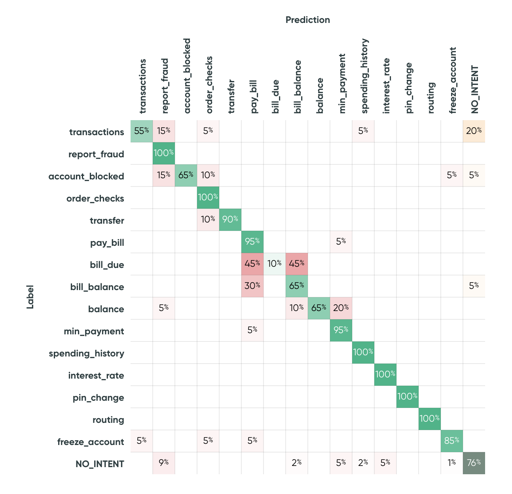

# Confusion Matrix

The confusion matrix displays the **model confusion between each pair of intents**. The confusion is
defined as the number of utterances with a given label that are predicted as another label. The
number of utterances is then **normalized** according to the total number of utterances with the
given label.

!!! tip "Outcome colors"

    The prediction [outcome](../../key-concepts/outcomes.md) colors are shown on the confusion
    matrix.

!!! example

    In this example, 55% of utterances labeled as `bill_due` were predicted as `bill_balance`.
