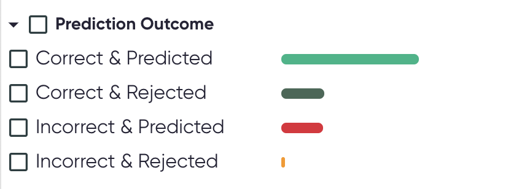
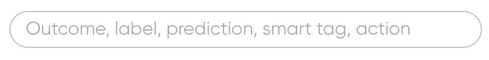

# Introduction to Exploration Space

The Exploration Space includes the datasets and predictions of your model in an interactive way.
Explore the utterances and the predictions, spot patterns in errors, and annotate the data to
trigger further work to improve the model's performance.

## Views

Interact with the Exploration Space in different views. Filter the data on any view with the control
panel. Both training and evaluation sets can be explored.

### [Performance Overview](performance-overview.md)

* Assess the quality of the metrics for any given subset of the data.
* Visualize the distribution of the confidences score, according to the outcome.
* See the most important words from the utterances, according to the outcome.

### [Confusion Matrix](confusion-matrix.md)

* Visualize the model confusion between each pair of intents.

### [Utterances Table](utterances-table.md)

* Explore the utterances, with their labels, predictions, and smart tags.
* Access all utterance details, including the detailed prediction results, the behavioral tests, and
  the most similar utterances.
* Annotate utterances to identify further work.

## Control Panel

All views are affected by the control panel.

!!! tip

    :material-share: The control panel selection can be saved and shared by using the url,
    which contains the selected filters and options.

    :material-arrow-collapse-left: It can also be collapsed to leave more space for the rest of
    the content.

### Evaluation Set and Training Set

{: style="width:400px"}

Explore the views on both the evaluation and the training set by clicking the toggle. Clicking on a
tab will update the view.

### Filters

Filter the data on any view according to different dimensions of the data, such as the model's
confidence, the utterances label, or the smart tags. The available categories and behaviors of
filters are listed below.

#### Filter Categories

* **Search a particular string** to filter utterances that contains it.
* Filter predictions based on their **confidence value**. You can specify a minimum and a maximum
  value.
* Filter predictions according to their [**outcomes**](../../key-concepts/outcomes.md).
* Filter by **labeled class** (the target).
* Filter by **predicted class**.
* Filter by [**smart tags**](../../key-concepts/smart-tags.md).
* Filter by user-applied [**proposed actions**](../../key-concepts/proposed-actions.md).

#### Filters Behavior

##### Bars Distribution

* The bar distributions to the right of the filters show
  the [outcome](../../key-concepts/outcomes.md) count for a given filter. Selecting or deselecting
  filters update the bars based on the current selection.
  {: style="width:400px"}

##### Filters Selection

* The checkbox beside the name of each filter category can be used to **select or deselect all**
  corresponding filters.
* When selecting filters, the other filters that can no longer be selected will be **greyed-out**.
    * Example: selecting a smart tag filter greys out the `NO_SMART_TAGS` option.
* The **number of utterances** currently selected by the filters is shown in parentheses at the top
  of the panel (beside the title `Filters`).
* Click `Clear filters` to **reset all filters** to the default values.

##### Negative filtering

* For smart tags and proposed actions, you can filter based on the **absence of all available
  filters** within a category, respectively `NO_SMART_TAGS` and `NO_ACTION`.

##### Search

* Use the search bar to find specific filters.
  {: style="width:400px"}
