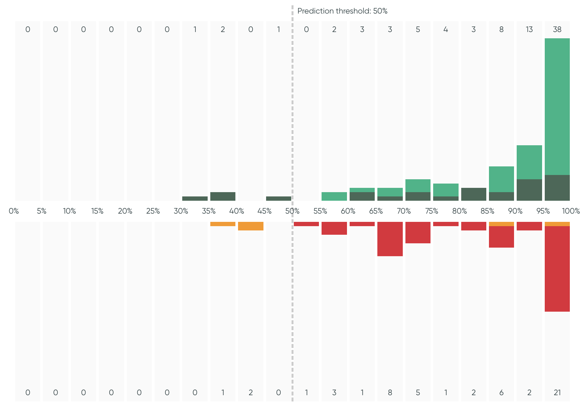
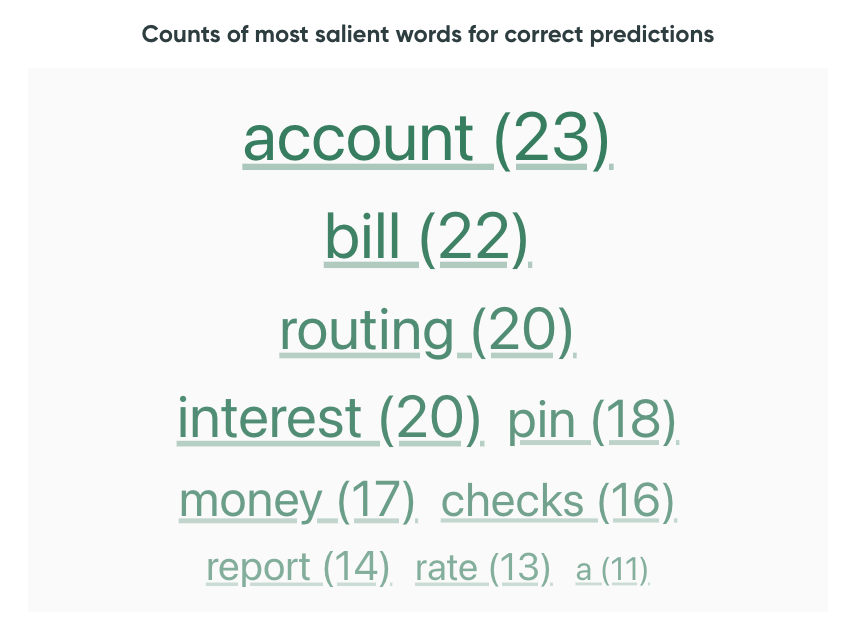

# Performance Overview

The Performance Overview centralizes the **metrics**, the **confidence histogram** and two **word
clouds** to show important words from the utterances.

## Metrics

Assess the quality of the model with different performance metrics. Hover over the information icon
to see more information on each metric.

* The first tile corresponds to the performance based on [**prediction
  outcomes**](../../key-concepts/outcomes.md):
    * :material-circle:{ .correct_predicted } **Correct & Predicted**
    * :material-circle:{ .correct_rejected } **Correct & Rejected**
    * :material-circle:{ .incorrect_rejected } **Incorrect & Rejected**
    * :material-circle:{ .incorrect_predicted } **Incorrect & Predicted**
* The 2nd and 3rd fields represent the **precision** and **recall**.
* The 4th field shows the **Expected Calibration Error** (ECE), which indicates the quality of the
  model's calibration. An ECE of 0 means perfect calibration; A lower ECE is better. Hover the ECE
  to show a plot that displays the breakdown of the ECE computation per bin.

## Confidence Histogram

The Confidence Histogram displays the distribution of model confidences, grouped-by [**prediction
outcomes**](../../key-concepts/outcomes.md). The threshold, if set in
the [:material-link: Project Configuration](../../reference/configuration/project.md), is displayed
on the plot.

!!! tip "Assess the distribution"

    Assess the confidence distribution by looking at the shape of the curve,
    the min and max values, and the ratio in each bin. Look at the histogram
    for any subset of the data by using the control panel.

## Word Clouds

To the right of the histogram is a word cloud showing the **most important words for correct and
incorrect predictions**. Correct predictions include `Correct & Predicted` and `Correct & Rejected`,
while incorrect predictions include `Incorrect & Predicted` and `Incorrect & Rejected`. The word
clouds change depending on the filters and indicate the frequency of each important word across all
filtered utterances.

Clicking on a word will filter utterances that contain it. Clicking it a second
time will clear that search filter, so does the ✗ in the `Search utterances` filter.

{: style="width:400px"}

!!! note "What does the word cloud count?"

    If [saliency maps](../../key-concepts/saliency.md) are available, the word clouds show the count
    of **salient words**. A word is considered salient in an utterance if the sum of its tokens'
    saliency values is greater than 60% of the largest saliency value in the utterance.

    If saliency maps are not available, the word clouds only show the most **frequent words** which
    are not part of a pre-defined list of **stop words**
    (from [nltk.corpus](https://github.com/nltk/nltk)).
