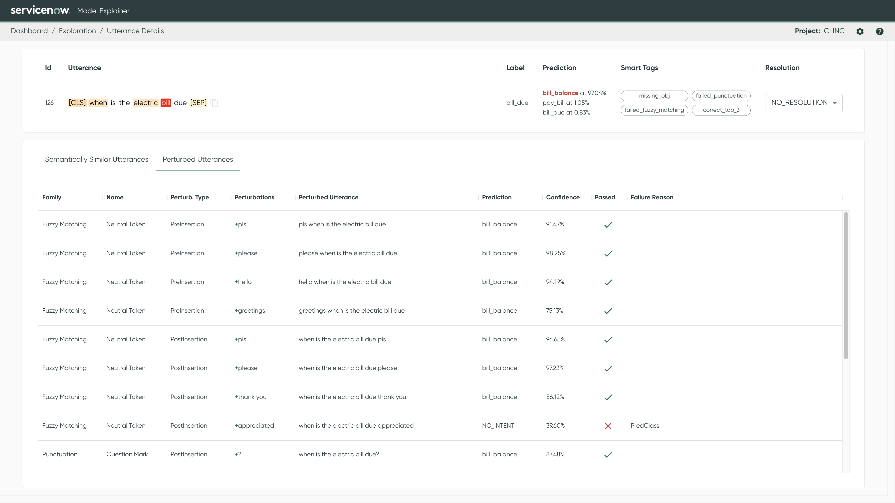

# Utterance Details

The utterance detail page shows more information about **individual utterances**. See the including
saliency per token, semantically similar utterances, and model performance on behavioral tests
automatically generated from the utterance.

## Utterance Information

The top section shows the utterance details:

* **Utterance**: The utterance and its per-token [saliency](../../key-concepts/saliency.md) (if
  available for the model's architecture). Hover over the tokens to the see the associated saliency
  value.
  * If pre-processing steps are returned by the pipeline, blue chevrons will be shown, allowing the utterance to be displayed after each pre-processing step, from the raw utterance to the processed version sent to the model.
* **Label**: The utterance's labeled class (the target).
* **Predictions**:
    * The **top 3** predictions for this utterance are shown.
    * The top prediction is highlighted using the prediction outcome color.
        * If the top prediction was converted to the rejection class based on the threshold, it will
          be added as a 4th element at the top.
    * By clicking on the blue chevrons, the prediction results after each post-processing step can be viewed, including the model's output before any post-processing.
* **Smart tags** (where applicable): An automatically computed tag highlighting a certain
  characteristic of the utterance (e.g., long sentences, utterance is missing a verb, utterance
  contains multiple sentences). For more information,
  see [Smart Tags](../../key-concepts/smart-tags.md).
* **Proposed Action** (editable): You can add a proposed action to identify further steps required
  for an incorrectly predicted utterance. For more information,
  see [Proposed Actions](../../key-concepts/proposed-actions.md).

## Semantically Similar Utterances

The *Semantically Similar Utterances* tab shows the **top 20 most similar utterances** in the
dataset as calculated using sentence embeddings. For more information,
see [:material-link: Similarity Analysis](../../key-concepts/similarity.md).

* The toggle buttons control whether to search for similar utterances in the evaluation set or the
  training set.
* Utterances that are similar but have different labels or predictions can indicate possible
  problems with the dataset or the model. An :warning: icon indicates utterances that are **from a
  different class** than the base utterance.
* Clicking on the row of an utterance in the table will open the details page for that utterance.

## Behavioral Tests

The *Behavioral Tests* tab displays the result of the behavioral tests that were run to test the **
model's robustness to minor modifications**. A failing test occurs when a modified utterance has a
different predicted class or when prediction certainty is altered by more than a set threshold. For
more information, see [:material-link: Behavioral Tests](../../key-concepts/behavioral-testing.md).

!!! note "Only available when a pipeline is defined"

    Behavioral tests are only available when a pipeline is available. As such, the tab will be
    empty for file-based configurations.
