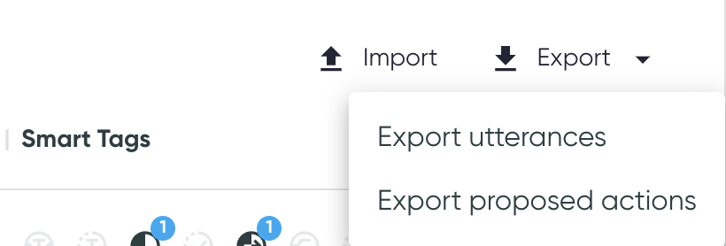

# Utterance Table

The utterance table view contains **all the utterances with their predictions**. The table also
includes information such as smart tags and proposed actions, if applicable.

To see **more details on an utterance**, click any row, which will open
the [:material-link: Utterance Details](utterance-details.md) page.

!!! tip "Open in a new tab"

    :fontawesome-solid-up-right-from-square: Open the utterance details in a new tab or in a new
    window using the ++ctrl++ or ++cmd++ + click or right-click menu.

## Table Content

!!! tip "Sort the table"

    :material-sort: Click a column header to sort the table by the column values. Each click
    rotates between ascending order, descending order, and no sorting.

### Id

A **unique index** for each utterance is generated for referencing purposes. When exporting the
utterances, the utterance index refers to the column `row_idx`.

If a persistent id is provided in the [columns](../../reference/configuration/project.md#columns) section of the config, hovering on the index will display both the generated index and the persistent id, when they differ.

### Utterance

Utterances appear as available in the dataset provided. Hover over the utterances to display the
**copy button :material-content-copy:**.

If available, the utterances are overlaid with **saliency maps**, highlighting the most important
tokens for the model's prediction. You can see the raw saliency values when hovering on the
utterance tokens in the [:material-link: Utterance Details](utterance-details.md) only. For more
information on how these values are calculated
see [:material-link: Saliency Map](../../key-concepts/saliency.md).

{: style="width:400px"}

### Prediction Information

The table shows the **labels**, **predicted classes**, and **confidences** for the utterances. If
the confidence is below the prediction threshold, the table reads `NO_PREDICTION` and the original
prediction in parentheses.

### Smart Tags

The table shows smart tag families, as well as the specific smart tag values on hover. For more
information, see [Smart Tags](../../key-concepts/smart-tags.md).

### Proposed Action

For each data point, the user can specify if an action needs to be
taken. [Proposed Actions](../../key-concepts/proposed-actions.md) are explained in the Key Concepts
section. The actions are done outside the app, using the exported list to resolve the utterance issues.

!!! tip "Apply in batch"

    Proposed actions can be applied in **batches** by selecting multiple rows (or selecting all
    based on the current search) and applying the change.

{: style="width:400px"}

#### Exporting
To export the proposed actions, two options are available:

1. **Exporting only the proposed actions**. In the CSV, only rows with proposed actions will be present, and the two columns will be the [persistent id](../../reference/configuration/project.md#columns) and the proposed action.
1. **Exporting the complete dataset**, including all columns (smart tags, predictions, and so on). This can be useful for purposes other than proposed actions.

#### Importing
From the CSV exported by the first option, proposed actions can be imported back into Azimuth using the import button.

* This can be useful if the dataset is changed (for example, labels modified or rows removed), and the user wants to verify if the proposed actions were resolved.
* It can also be useful if you need to kill Azimuth and restart it without having access to the cache.
* By default, if some persistent ids are in the imported file, but not in the dataset in Azimuth, they will be ignored.
