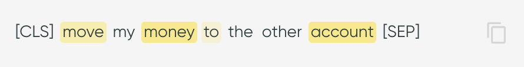

# Utterances Table

The utterance table view contains **all the utterances with their predictions**. The table also
includes information such as smart tags and proposed actions, if applicable.

To see **more details on an utterance**, click any row, which will open
the [:material-link: Utterance Details](utterance-details.md) page.

!!! tip "Open in a new tab"

    :fontawesome-solid-up-right-from-square: Open the utterance details in a new tab or in a new
    window using the ++ctrl++ or ++cmd++ + click or right-click menu.

## Table Content

!!! tip "Sort the table"

    :material-sort: Click a column header to sort the table by the column values. Each click
    rotates between ascending order, descending order, and no sorting.

### ID

A **unique ID** for each utterance is created for referencing purposes. When exporting the
utterances, the utterance ID refers to the column `row_idx`.

### Utterance

Utterances appear as available in the dataset provided. Hover over the utterances to display the
**copy button :material-content-copy:**.

If available, the utterances are overlaid with **saliency maps**, highlighting the most important
tokens for the model's prediction. You can see the raw saliency values when hovering on the
utterance tokens in the [:material-link: Utterance Details](utterance-details.md) only. For more
information on how these values are calculated
see [:material-link: Saliency Map](../../key-concepts/saliency.md).

{: style="width:400px"}

### Prediction Information

The table shows the **labels**, **predicted classes**, and **confidences** for the utterances. If
the confidence is below the prediction threshold, the table reads `NO_PREDICTION` and the original
prediction in parentheses.

### Smart Tags

The table shows smart tag families, as well as the specific smart tag values on hover. For more
information, see [Smart Tags](../../key-concepts/smart-tags.md).

### Proposed Action

For each data point, the user can specify if an action needs to be
taken. [Proposed Actions](../../key-concepts/proposed-actions.md) are explained in the Key Concepts
section. The actions are done outside the app. Export the proposed actions in a `.csv` file and use
the list to resolve the utterance issues. The exported file also contains the smart tags.

!!! tip "Apply in batch"

    Proposed actions can be applied in **batches** by selecting multiple rows (or selecting all
    based on the current search) and applying the change.
