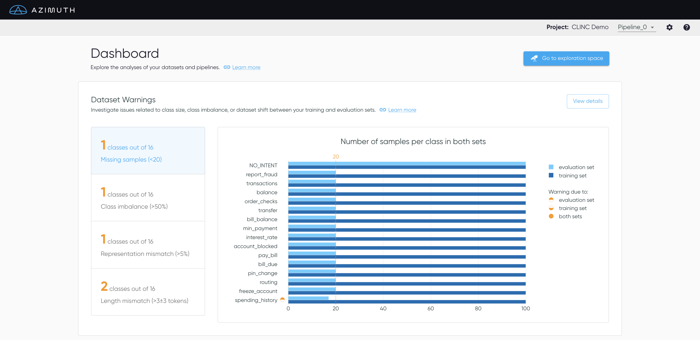

# Dashboard

**Welcome to Azimuth!**

Explore the different analyses and tools of Azimuth using the dashboard. Navigate through the
different sections to get a deeper understanding of the dataset and the model.

!!! info "Use Azimuth with no pipeline, or with multiple pipelines"

    Azimuth can be launched without any pipelines. All the information related to the pipelines
    (prediction, behavioral testing and so on) will then be unavailable on all screens. It can also be
    launched with multiple pipelines. Use the dropdown in the top banner to switch between
    pipelines.

## Top Banner

The top banner contains useful information and links.

* The **project name** from the config file is shown.
* A dropdown :material-arrow-down-drop-circle-outline: allows you to select the different pipelines
  defined in the config. It also allows you to select no pipelines.
* The [**settings**](settings.md) :gear: allow you to enable/disable different analyses.
* A link to the documentation is available in the help :material-help-circle: option.

!!! tip "Don't miss out on the exploration space!"

    :fontawesome-brands-wpexplorer: At the top, access the
    [**Exploration Space**](exploration-space/index.md) to explore and interact with the utterances
    and the predictions.

## Dataset Class Distribution Analysis

The Distribution Analysis section highlights **gaps between the class distributions** of the
training and the evaluation sets.

* **Missing samples**: Verify if each intent has sufficient samples in both sets.
* **Representation mismatch**: Assess that the representation of each intent is similar in both
  sets.
* **Length mismatch**: Verify that the utterances' length are similar for each intent in both sets.

Select `View Details` to get
to [:material-link: Dataset Class Distribution Analysis](dataset-warnings.md).

## Performance Analysis

The Performance Analysis section summarizes the model performance in terms of the [**prediction
outcomes**](../key-concepts/outcomes.md) and **metrics** available in Azimuth. Change the value in
the dropdown :material-arrow-down-drop-circle-outline: to see the metrics broken down per label,
predicted class, or smart tag families. Use the toggle to alternate between the performance on the
training set or on the evaluation set.

!!! tip "Sort the table and hide columns"

    :material-sort: Click a column header to sort the values in ascending or descending order.
    The default order is descending by the number of utterances, except for
    `NO_PREDICTION`/`NO_SMART_TAGS` which will be first. `overall` always stay at the top.

    :material-dots-vertical: Beside each column header, click the vertical dots to hide the
    corresponding column, or multiple ones by selecting 'Show columns'. However, the table columns
    will reappear as soon as the table is modified (e.g. sorting) or if the page is refreshed.

!!! tip "Go to the exploration space to interact with metrics"

    :fontawesome-brands-wpexplorer: The same metrics are available on the
    [:material-link: Exploration Space](exploration-space/index.md), where you can filter by any
    combination of values, and see more information on what each metric represents.

## Behavioral Testing

The Behavioral Testing section summarizes the behavioral testing performance. The **failure rates**
on both the evaluation set and the training set highlight the ratio of failed tests to the total
amount of tests.

Click the failure rates to alternate between the performance on the training set or on the
evaluation set. Select `View details` to get
to [:material-link: Behavioral Testing Summary](behavioral-testing-summary.md), which provides more
information on tests and the option to export the results.

!!! tip "Scrollable table"

    :octicons-sort-desc-16: The data is ordered in descending order by failure rate. The table is
    scrollable.

!!! note "File-based configurations"

    With file-based configurations, the behavioral tests are generated and can be exported.
    However, since the tool does not have access to the model, predictions cannot be made for the
    modified utterances. As such, by default the tests have a failure rate of 0% (the new
    prediction is hard-coded to the original value).

## Post-processing Analysis

The Post-processing Analysis provides an assessment of the performance of one post-processing step:
the thresholding. The visualization shows the prediction [outcome](../key-concepts/outcomes.md)
count on the evaluation set for different thresholds. Click `View Details` to see the plot full
screen in [:material-link: Post-processing Analysis](post-processing-analysis.md).

!!! note "Only available for some configs"

    This section is only available when the threshold is known and can be edited.
    This means it is unavailable for file-based configs, and for pipelines with their own
    postprocessors, i.e. when postprocessors are set at `null`.
