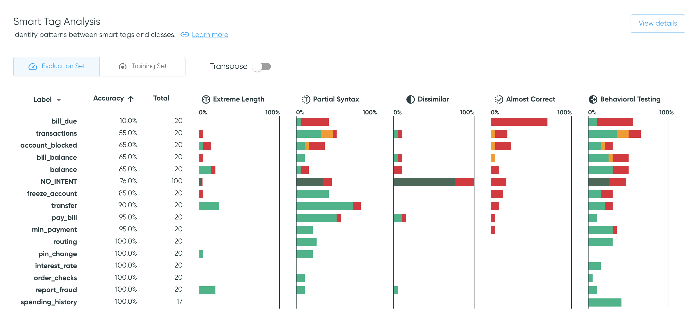
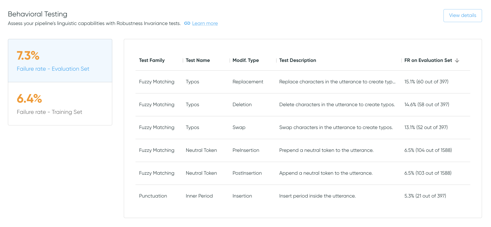
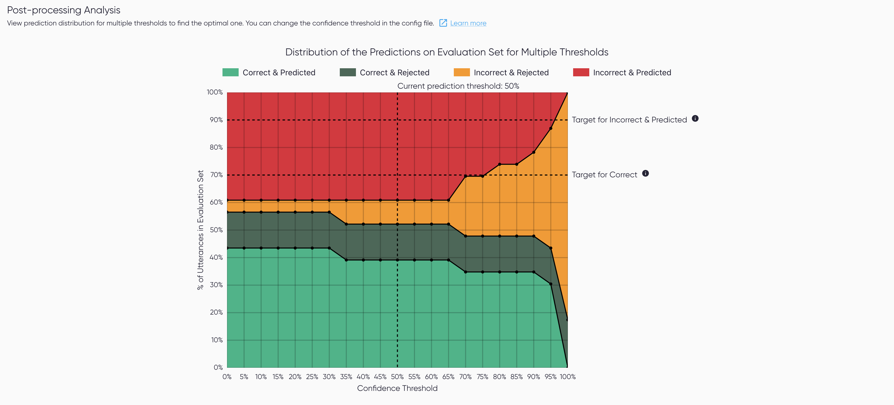

# Dashboard

**Welcome to Azimuth!**

Explore the different analyses and tools of Azimuth using the dashboard. Navigate through the
different sections to get a deeper understanding of the dataset and the pipeline.

!!! info "Use Azimuth with no pipeline, or with multiple pipelines"

    Azimuth can be launched without any pipelines. All the information related to the pipelines
    (prediction, behavioral testing and so on) will then be unavailable on all screens. It can also be
    launched with multiple pipelines. Use the dropdown in the top banner to switch between
    pipelines.

## Top Banner

The top banner contains useful information and links.

* The **project name** from the config file is shown.
* A dropdown :material-arrow-down-drop-circle-outline: allows you to select the different pipelines
  defined in the config. It also allows you to select no pipelines.
* The [**settings**](settings.md) :gear: allow you to enable/disable different analyses.
* A link to the support Slack channel and to the documentation is available in the help
  :material-help-circle: option.

!!! tip "Don't miss out on the exploration space!"

    :fontawesome-brands-wpexplorer: At the top, access the
    [**Exploration Space**](exploration-space/index.md) to explore and interact with the utterances
    and the predictions.

## Dataset Warnings

The dataset warnings section highlights issues related to **class size**, **class imbalance** and **dataset shift**, i.e. differences between the data distributions of the training and the evaluation sets.

* **Missing samples**: Verify if each intent has sufficient samples in both sets.
* **Class imbalance**: Flag when some classes suffer from imbalance in either split.
* **Representation mismatch**: Assess that the representation of each intent is similar in both
  sets.
* **Length mismatch**: Verify that the utterances' length are similar for each intent in both sets.

Select `View Details` to get to [:material-link: Dataset Warnings](dataset-warnings.md).

## Class Overlap

The Class Overlap section gives an overview of the semantic overlap between class pairs. In some
cases, high overlap may be associated with poor class definitions, mislabelling, and/or model
confusion.

Select `View details` to access the [:material-link: Class
Overlap](class-overlap.md) page with an interactive
[Class Overlap Plot](class-overlap.md#class-overlap-plot).

### Table Content

The Class Overlap table presents class pairs that have nonzero class overlap or pipeline
confusion.

Each row shows a source class and a target class, where the source class is the class of the
samples being analyzed (e.g., class label for pipeline confusion), and the target class is the
class that the source class may look like, through the lens of the dataset or the model (e.g.,
prediction for pipeline confusion).

* **Semantic Overlap Score**s are calculated for class pairs in the training data based on the
  locations of utterances in embedding space, as described in
  [:material-link: Similarity Analysis](../key-concepts/similarity.md). Because it is
  determined on a dataset alone, it does not require a pipeline to be supplied.
* **Utterances with Overlap** indicates the percentage of samples in the source class that are
  determined to overlap the target class, as well as the sample count with overlap
  relative to the total sample count for the source class. This is also based on the training data.
* **Pipeline Confusion** is presented if a pipeline is provided. Pipeline confusion indicates
  confusion of the source class for the target class (i.e., the confusion matrix cell
  where the label is the source class and the prediction is the target class), for the
  evaluation data.

As class overlap indicates semantic similarity in embedding space, it may or may not be associated
with pipeline confusion.

For example, if high overlap is due to mislabeling or poor class differentiation, it may be
associated with pipeline confusion. On the other hand, it's possible to have a pair of classes
that are semantically very similar, but have a distinguishing feature that the model can learn,
such as specific nouns. In these cases, class overlap may be expected, but not associated with
model confusion.

Thus, overlap values can help direct attention to dataset characteristics to explore to
determine whether a change should be made (typically data augmentation or relabeling) or if the
semantic overlap is acceptable.

!!! note "Training vs Evaluation Data"

    Note that Class Overlap is calculated on the training data, whereas Pipeline Confusion is
    calculated on the evaluation data. Thus, the two analyses have different source class sample
    counts.

!!! tip "Sorting"

    :material-sort: The data is ordered by overlap value, in descending order. Click the overlap
    or confusion value headers to sort the values in ascending or descending order.

## Pipeline Metrics by Data Subpopulation

This section summarizes the quality of the predictions in terms of the [**prediction
outcomes**](../key-concepts/outcomes.md) and **metrics** available in Azimuth, for different data subpopulations. Change the value in the dropdown :material-arrow-down-drop-circle-outline: to see the metrics broken down per label, predicted class, or smart tag families. Use the toggle to alternate between the training set or on the evaluation set.

The user can click on any row in the table to get directly to the exploration space with the corresponding filters applied. This allows for further investigation of errors. As an example, clicking on the row with the label `freeze_account` will bring the user to the exploration space with that same filter applied. This works with prediction classes and smart tags too.

Click on `Compare pipelines` to display the table fullscreen and compare all metrics across pipelines, as explained in [Pipeline Metrics Comparison](pipeline-metrics-comparison.md).

!!! tip "Sort the table and hide columns"

    :material-sort: Click a column header to sort the values in ascending or descending order.
    The default order is descending by the number of utterances, except for
    `NO_PREDICTION`/`NO_SMART_TAGS` which will be first. `overall` always stay at the top.

    :material-dots-vertical: Beside each column header, click the vertical dots to hide the
    corresponding column, or multiple ones by selecting 'Show columns'. However, the table columns
    will reappear if the page is refreshed.

!!! tip "Go to the exploration space to interact with metrics"

    :fontawesome-brands-wpexplorer: The same metrics are available on the
    [:material-link: Exploration Space](exploration-space/index.md), where you can filter by any
    combination of values, and see more information on what each metric represents.

## Smart Tag Analysis

The Smart Tag Analysis shows the proportion of samples that have been tagged by each smart tag
family, broken down by [**prediction outcomes**](../key-concepts/outcomes.md), along with
sample counts and prediction accuracies.
Use the dropdown :material-arrow-down-drop-circle-outline: to switch between values for labels or
for predictions. Use the toggle to alternate between the training and evaluation sets.

The `Transpose` toggle transposes the table and thus the axes for each bar plot.
The default view aides analysis of each smart tag across all classes, whereas
the transposed view makes it easier to investigate the smart tag pattern for a specific class.

Select `View details` to get to
[:material-link: Smart Tag Analysis](smart-tag-analysis.md).

!!! tip "Sort the table by bar plot columns"

    :material-sort: Click a column header (or row label if transposed) to sort the values in
    ascending or descending order. This works for bar plot columns as well as numerical columns.
    The default order is descending by the number of utterances, except for
    the rejection class, which will be first.

!!! tip "Go to the exploration space to see samples"

    :fontawesome-brands-wpexplorer: Clicking on a bar takes you to the exploration space with
    corresponding filters applied, where you can further explore the tagged samples,
    including the specific smart tags applied.

## Behavioral Testing

The Behavioral Testing section summarizes the behavioral testing performance. The **failure rates**
on both the evaluation set and the training set highlight the ratio of failed tests to the total
amount of tests.

Click the failure rates to alternate between the performance on the training set or on the
evaluation set. Select `View details` to get
to [:material-link: Behavioral Testing Summary](behavioral-testing-summary.md), which provides more
information on tests and the option to export the results.

!!! tip "Scrollable table"

    :octicons-sort-desc-16: The data is ordered in descending order by failure rate. The table is
    scrollable.

!!! note "File-based configurations"

    With file-based configurations, the behavioral tests are generated and can be exported.
    However, since the tool does not have access to the model, predictions cannot be made for the
    modified utterances. As such, by default the tests have a failure rate of 0% (the new
    prediction is hard-coded to the original value).

## Post-processing Analysis

The Post-processing Analysis provides an assessment of the performance of one post-processing step:
the thresholding. The visualization shows the prediction [outcome](../key-concepts/outcomes.md)
count on the evaluation set for different thresholds. Click `View Details` to see the plot full
screen in [:material-link: Post-processing Analysis](post-processing-analysis.md).

!!! note "Only available for some configs"

    This section is only available when the threshold is known and can be edited.
    This means it is unavailable for file-based configs, and for pipelines with their own
    postprocessors, i.e. when postprocessors are set at `null`.
