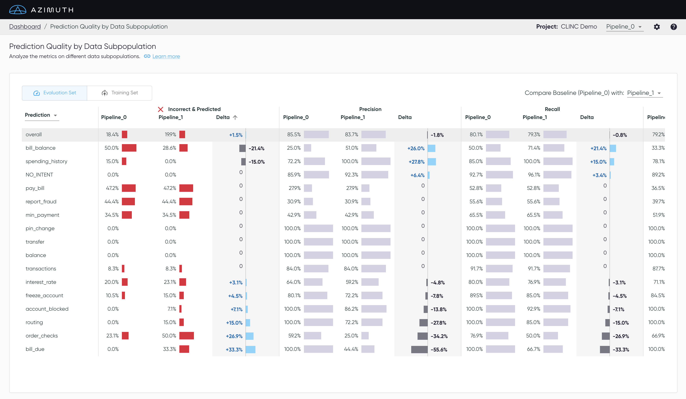

# Pipeline Metrics Comparison

This table summarizes the quality of the predictions for different data subpopulations. When selecting a second model next to `Compare Baseline with`, the table will display the metrics for both the baseline and the second model, along with delta columns that show the difference for each metric and subpopulation. All interactions available from the [Dashboard](index.md) are also available here, including the ability to sort and hide columns, and to click on a row.
