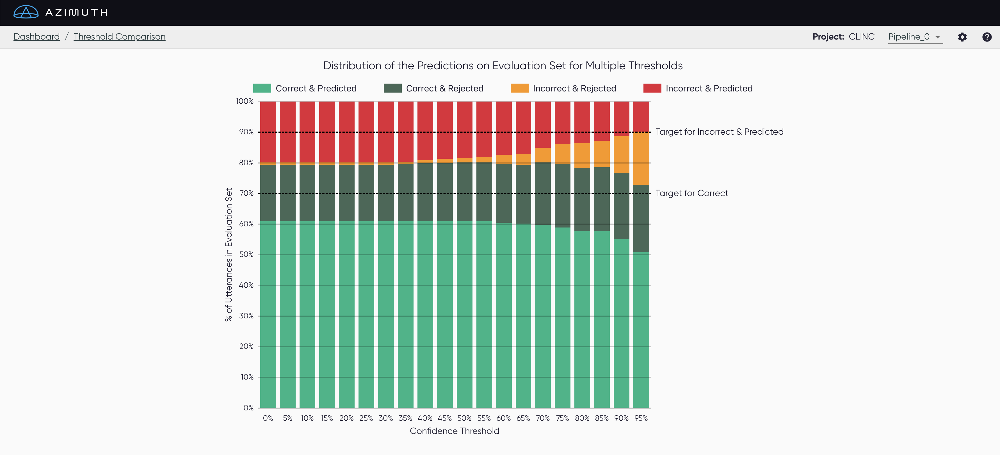

# Post-processing Analysis

## Threshold Comparison

With the Threshold Comparison page, you can compare the performance of the model on the evaluation
set at **different threshold values**. The visualization shows the performance for threshold values
between 0 and 100%, with increments of 5%. The current threshold value is displayed as a vertical line.

A suggested minimum amount of correct predictions, as well as a maximum amount of incorrect
predictions, are displayed on the plot.

!!! note "Only available for some configs"

    This section is only available when the threshold is known and can be edited.
    This means it is unavailable for file-based configs, and for pipelines with their own
    postprocessors, i.e. when postprocessors are set at `null`.
