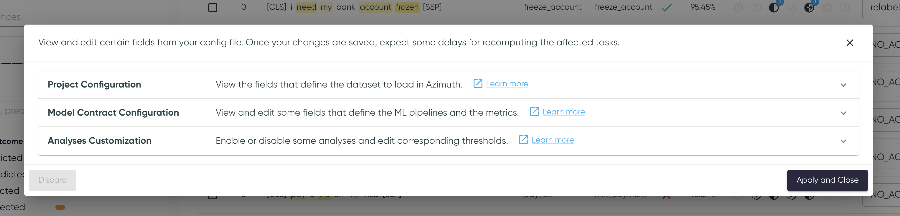

# Settings

The settings page allows the user to edit the config.
Click on :fontawesome-solid-gear: in the top right of the Azimuth app to access it.

* `Discard` any current modifications if you change your mind.
* When clicking `Apply and Close`, the start-up tasks may start again, depending on the changes made to the config.
* Only some fields are modifiable through this screen.
